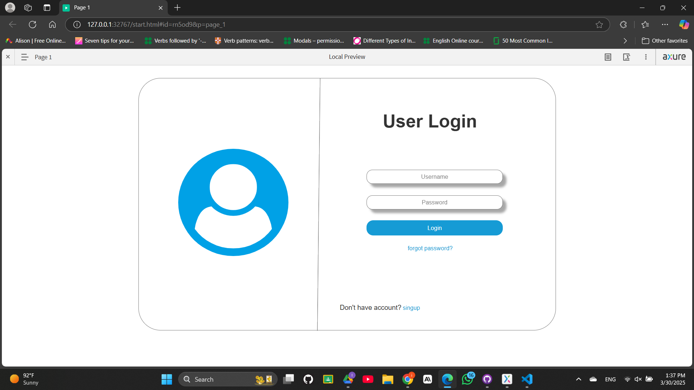
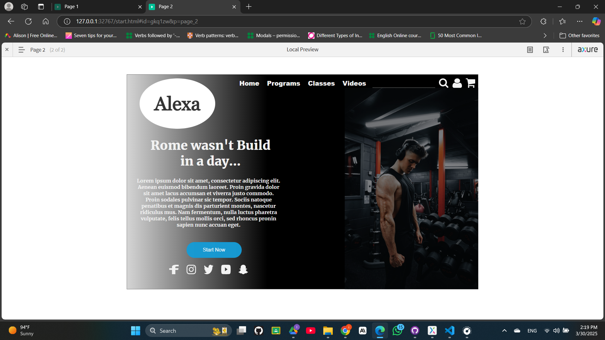

# Day 01 - Creating Simple Interfaces and Interactions

This directory contains a series of exercises covering various concepts.

## Exercise List

### 1. Simple Login Screen
- Design a simple login screen

#### Output

### 2. Create a web page
- Create a web page similar to the given image

#### Output

## Getting Started
All exercises are implemented in the Day1.rp file.
To run the exercises, open the Day1.rp file in Axure RP 9 and navigate to preview.
Screenshots of the pages are provided in the Day01 directory.
