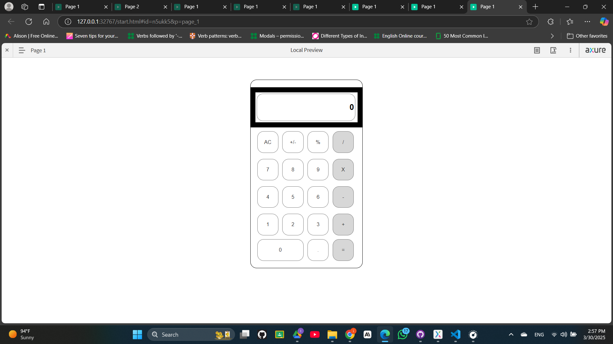

# Day 02 - Creating  a Simple Calculator and it's Interactions

This directory contains a exercise covering designing calculator interface and complex interaction creation.

## Exercise List

### 1. Simple Calculator Interface
- Designing A simple Calculator interface
- Complex interaction creation
- Use variables
- Creating interactions for all the numbers

#### Output

## Getting Started
The exercise is implemented in the Day02.rp file.
To run the exercises, open the Day02.rp file in Axure RP 9 and navigate to preview.
Screenshot of the pages are provided in the Day02 directory.
